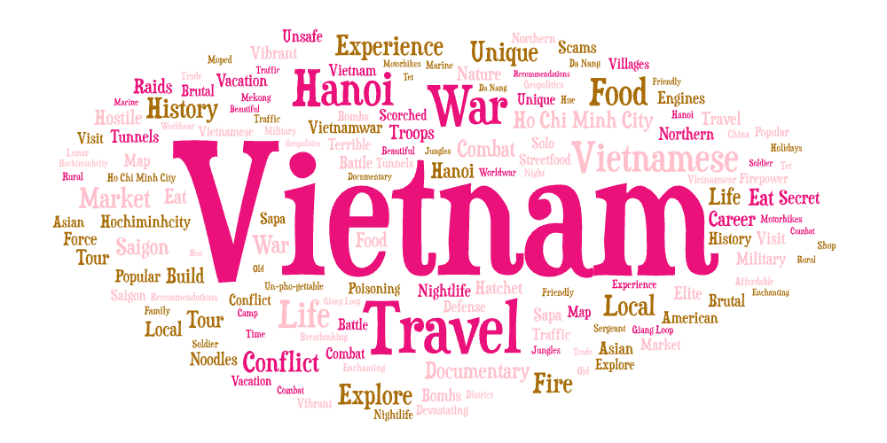
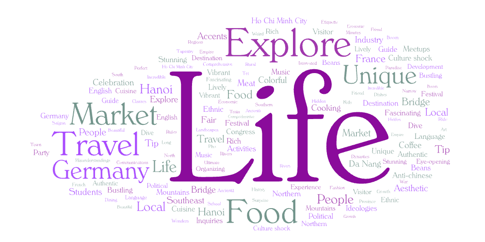
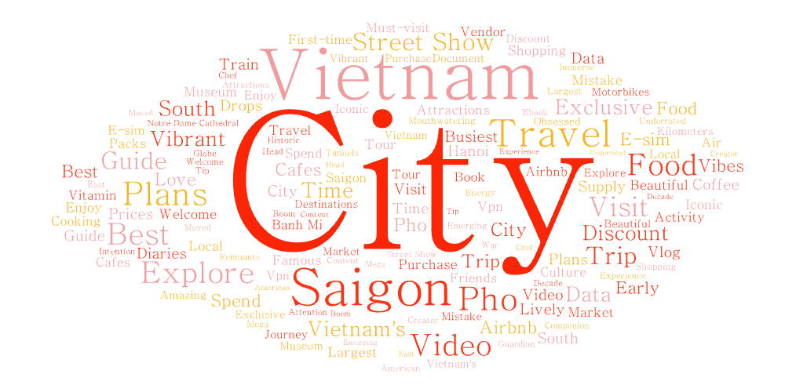

# Youtube Word Cloud Analysis

## Project Overview

This project analyzes YouTube search results using three different keywords: **Vietnam**, **Ho Chi Minh City**, and **Vietnam Culture**. By generating word clouds from youtube video metadata, this study explores how digital media represents Vietnam across national, urban, and cultural perspectives.

---

## Search Topic and Parameters

**Search Parameters:**
- Keywords: Vietnam, Vietnam Culture, Ho Chi Minh City (HCMC in this README)
- Platform: YouTube
- Data collected: Data collected: Video titles, short descriptions, metadata (views, upload time, creator)

Web Crawler uses Selenium and BeautifulSoup

---

## Purpose

The purpose of this comparison is to analyze how different search terms related to the same country generate different digital narratives. While "Vietnam" represents a broad national perspective, "Ho Chi Minh City" reflects an urban and local scale, and "Vietnam Culture" focuses on social and traditional aspects. Comparing these three queries helps reveal how geography and topic-framing influence online content.

---

## Word Cloud Comparison

### Vietnam
This word cloud contained a broad range of keywords related to the country. This includes topics such as history, travel, and aesthetics. Surprisingly, A noticeable portion of the most frequent terms were related to war-related content. As an educational aspect, the history of Vietnam war conflicts remains a dominant theme in online discussions about Vietnam. Other general words describe the experiences in Vietnam (Vibrant, Market, Food, etc.)

### Vietnam Culture
This word cloud focused more on local cultural experiences. The most frequent terms were related to food, events, and travel, such as cuisine, market, festival, and colorful. Compared to the general Vietnam search, this dataset emphasized tradition (and what Vietnam is to locals and tourists) rather than history or politics.

### Ho Chi Minh City
The HCMC word cloud was more centered on urban activity and local experiences. Common keywords such as Saigon (Prior name of city), cafes, banh mi, lively, and explore represents the lifestyle and street culture. Unlike the national-level results above (Vietnam), this search emphasized modern city life, tourism, and commercial activity.

### Overall Comparison
Overall, the three word clouds reveal patterns based on search queries. The Vietnam word cloud emphasized broad national themes with a strong presence of war-related words, while the Vietnam Culture search highlighted traditions, food, and identity. In contrast, the Ho Chi Minh City word cloud differed from the other two word clouds in its focus on urban life, but was similar to the Vietnam Culture query by describing everyday experiences. Together, these results demonstrate how online representations of Vietnam shift depending on geographic scale.

---

## Explanation of Patterns

The patterns observed in the word clouds may be influenced by different content creators, audiences, and platform algorithms. General searches such as "Vietnam" tend to attract tourism, news, and educational content, while city-based searches reflect everyday life and urban activities. Cultural searches often emphasize traditions and heritage.

---

## Limitations and Future Improvements

This research could be improved by increasing the number of videos collected, expanding the time range, and including additional related search terms. Filtering by language or region could also improve geographic accuracy. Future work could incorporate engagement metrics such as views or likes to better understand audience behavior. Additionally, many of the short descriptions required heavy filtering and text-splitting to find keywords. Future work can apply automated text-cleaning techniques.

---

## Key Observations and Unexpected Findings

One unexpected finding was that there were so many words when I imported my CSV file to the Wordcloud visualizer. Another notable observation was that while there was some overlap in words, there was also notable patterns based on the search term.

*(IE Vietnam search term gave a more general/political view, HCMC gave tourist/historical words, and Vietnam culture gave what tourist tend to come to Vietnam for).*

These results suggest that online representations of Vietnam vary significantly depending on audience focus.

---

## Data (CSV)

- [Vietnam Search Results](assets/vietnam-1.csv)
- [Ho Chi Minh City Search Results](assets/vietnam-culture-2.csv)
- [Vietnam Culture Search Results](assets/ho-chi-minh-city-3.csv)

---

## WordClouds

### Vietnam

### Ho Chi Minh City

### Vietnam Culture
